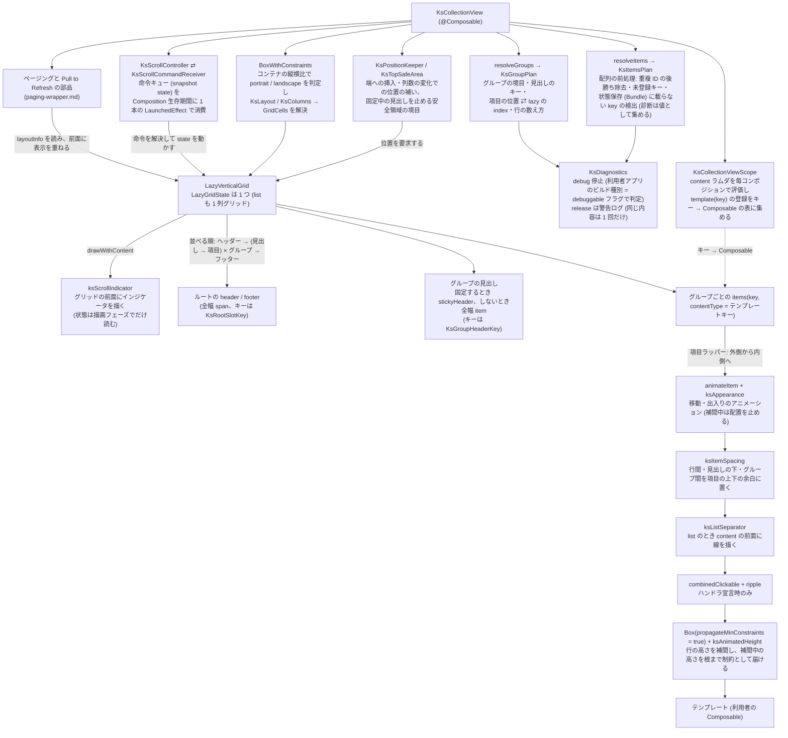

# Android Compose ラッパー

この文書を読むと、Android の `KsCollectionView` が Compose の Lazy 系にどう載っていて、core の契約 ([collection-items](../../core/core-model/collection-items.md) / [collection-layout](../../core/styling/collection-layout.md) / [collection-interaction](../../core/core-model/collection-interaction.md)) のどの部分をどの部品が担い、Compose のどの挙動を回避しているかが分かる。core の 3 文書を先に読むと分かりやすい。iOS の対応物は [iOS コレクションエンジン](../../ios/architecture/collection-engine.md)。画像の先読みと `KsImage` の Android 側の実現は [Android 画像の先読みと KsImage の実現](image-pipeline.md)、ページングと Pull to Refresh の実現は [Android ページングと Pull to Refresh の実現](paging-wrapper.md) にある。

## 目的

Android は独自の描画エンジンを持たず、Compose Lazy 系の薄いラッパーである (core/ADR-0001)。ラッパーの仕事は、公開 DSL (スコープで集めたテンプレートと引数) を `LazyVerticalGrid` の DSL に流し込み、Compose がそのままでは満たさない core の契約 (不正入力の縮退・命令の順序保証・区切り線・content 配置・行の高さ変化・グループの並べ方と間隔・端への挿入・スクロールインジケータ) をその周りで成立させることに限る。iOS 側 (ios/ADR-0004) と同じく、独自のデータ保持層 (Store) や差分計算層を持たない。差分は Compose の `key` に委ね、配置の変化は `animateItem` で見せる (android/ADR-0006)。テンプレートのラムダは item の合成の中で実行されるため、そこで読んだ親の State は自動で購読され、iOS の `observedValue(_:)` に当たる指定は無い (ios/ADR-0008)。

## 構成

list も grid も同じ `LazyVerticalGrid` で描き、list は `GridCells.Fixed(1)` の 1 列グリッドである (android/ADR-0001)。`LazyColumn` は使わない。グループを宣言しない場合も、配列全体を値なしの 1 つのグループとして同じ並べ方に乗せる (見出しは並べない)。

## 責務境界

| 部品 | 責務 |
|---|---|
| `KsCollectionViewScope` (`@DslMarker`) | `template(key) { }` / `template { }` の登録をキー → `@Composable (Item) -> Unit` の表に集める。単一テンプレート形は、利用者からは見えない内部固定キーへの登録として同じ表に載る。同じキーへの二重登録は後勝ち (core/ADR-0011) |
| `resolveItems` / `KsItemsPlan` | `items()` に渡す前に配列を走査し、重複 ID を後勝ちで除去、未登録テンプレートキーと Bundle に載らない `key` を診断として集める。未登録キーの要素は最小高 1dp の空 item として残し件数を保つ。`contentType` にはテンプレートキーをそのまま渡す |
| `KsDiagnostics` | 診断を debug では `IllegalStateException` で止め、release では警告ログ (タグ `KsCollectionView`) にする。debug 判定は組み込み先アプリの debuggable フラグ。`WarnOnce` が同じ内容の警告を再コンポジションで繰り返さない |
| `KsLayout` / `KsColumns` | layout 値の値型。不正値 (0 以下の列数・負の spacing) の診断と、負の間隔を 0 にした実効値。`GridCells` への変換は `BoxWithConstraints` で列数を決めてから行う |
| `KsGroups` / `resolveGroups` / `KsGroupPlan` (`KsGroupPlan.kt`) | 配列を走査して同じグループの値が続く範囲をグループにし、離れて現れた同じ値と Bundle に載らないグループの値を診断に集める。構成表は項目の位置 ⇄ lazy の index の写像と、`KsGroupRows` (行の数え方) を持つ。表の大きさはグループの数に比例し、項目の数には比例しない |
| `KsGroupHeaderKey` / `KsRootSlotKey` | グループの見出しとルートのヘッダー / フッターの lazy のキー。ライブラリ内部の `Parcelable` で包み、項目の `key` と衝突させない (後述) |
| `KsGroupSpacing` / `ksItemSpacing` | 行間・見出しの下の間隔・グループ間の間隔を、項目の上下の余白として置く (後述) |
| `ksListSeparator` (`KsListSeparator.kt`) | list のときだけ、各項目の前面 (`drawWithContent` で content 描画後) にグループの先頭行の上端と全項目の下端の線を全幅 1dp で描く。見出しが無ければ上端の線は最初のグループだけ (core/ADR-0016)。色は `listSeparatorColor` 未指定なら `#D9D9DE` |
| 項目のタップ | `onItemTap` / `onItemLongTap` のいずれかがあるときだけ `combinedClickable` で包む。indication は material3 の ripple (android/ADR-0003) |
| `ksAnimatedHeight` (`KsAnimatedHeight.kt`) | 行の高さ変化を補間し、補間中は content を現在の高さで測り直して描画を切り取る (android/ADR-0004)。content は上端固定・水平中央 (`Alignment.TopCenter` 相当。ios/ADR-0007 の規則) |
| `ksAnimateItem` / `KsAnimatedItemBox` / `KsFullSpanBox` | 項目・グループの見出し・ルートのヘッダー / フッターに `animateItem` を付け、配列の差し替えによる移動と出入りをアニメーションで見せる (android/ADR-0006。後述) |
| `KsPositionKeeper` / `KsAppearingItems` (`KsAppearingItems.kt`) | 配列の差し替えと列数の変化の直前の配置から、端を表示中の端への挿入と、固定中の見出しの下の項目の位置を補う。末尾への挿入で表示範囲の外に足された項目は、最初に配置されたときにフェードさせる (後述) |
| `KsTopSafeArea` / `ksPinnedHeaderSafeArea` (`KsTopSafeArea.kt`) | コレクションの上端・下端が安全領域に重なる長さ (`overlapPx` / `bottomOverlapPx`) を求め、固定中の見出しをその境目で止める (後述)。一覧に重ねる表示の位置にも使う |
| `ksScrollIndicator` / `rememberKsScrollIndicatorVisibility` (`KsScrollIndicator.kt`) | `LazyVerticalGrid` の前面 (`drawWithContent`) に縦のインジケータを描く。見た目と時間は `KsScrollIndicatorDefaults` の定数 (iOS の既定の実測値)。表示の濃さは利用者のドラッグで始まったスクロール (慣性を含む) の間だけ 1 にし、止まって 1 秒後に 250 ms でフェードする。位置と長さは `LazyGridState.scrollIndicatorState` を `ksGroupedScrollIndicatorMetrics` で数え直して求める |
| ページングと Pull to Refresh の部品 (`KsPagingRequester` / `KsPaging` / `KsPullRefresh` / `ksBlockingTouches`) | 次ページ要求の判定と待ち方、6 つの表示の置き場、引っ張りの受け付けとインジケータ。詳細は [Android ページングと Pull to Refresh の実現](paging-wrapper.md) |
| `KsScrollController` / `KsScrollCommandReceiver` | 命令を receiver のキューに積み、コンポジション後に最新の配列で ID を項目の位置にし、`KsGroupPlan` の写像で lazy 上の置き場所 (index・上下の余白・固定される見出しのキー) へ解決して `LazyGridState` を動かす。未接続 no-op、複数接続は最後勝ち、メインスレッド契約 |

## 保証すること (実測で確かめた罠対策)

### 命令は 1 本の LaunchedEffect で消費し、配列更新で再起動しない

消費側は Composition の生存期間に 1 本だけ立てる `LaunchedEffect(receiver)` の coroutine で、`snapshotFlow` でキューの変化を待ち、命令を FIFO で 1 つずつ取り出して、その時点の最新の配列 (`rememberUpdatedState` 経由) で解決する。配列をキーにした `LaunchedEffect(items, …)` にすると配列更新のたびに実行中のアニメーションがキャンセルされ命令が消えうる。配列更新と命令が同じ再コンポジションで届くため、命令はコンポジション後に更新後の配列で解決される (core/ADR-0007 の「データ反映後に実行」)。

### Center / End は 1 回の命令に集約し、逆向きの補正を入れない

`animateScrollToItem(index, scrollOffset)` を 1 回だけ呼ぶ。`scrollOffset` は対象の高さの推定値 (可視なら実測、同じ `contentType` の可視項目の平均、無ければ可視項目全体の平均の順) から計算する。到着後の残差は、アニメーション時は進行方向と同じ向きで 4dp を超えるときだけ詰め、逆向きには補正しない。非アニメーション時は残差をそのまま詰める。「対象を先頭合わせで可視化してから `scrollBy` で中央へ寄せる」2 段階は、行き過ぎてから約 4 行分戻る動きになる。実機 A/B では、2 段階方式でスクロール方向が逆転するフレームが 15 あったのに対し、1 回集約では 0 になった。

### 区切り線は content の前面に描く

`drawBehind` (背面) では不透明な背景を持つテンプレートで線が 1 本も見えず、iOS 側 (区切り線は content の前面 — [iOS コレクションエンジン](../../ios/architecture/collection-engine.md)) と食い違う。`drawWithContent { drawContent(); … }` で content の後に描く。項目単位の描画は `LazyVerticalGrid` の再利用と両立し、行間に区切り線用の item を挿入する形 (項目数が倍になり index 解決が複雑化) を避けられる。

### 行の高さ変化は自前の補間で、補間中だけ測り直しと切り取りを行う

`animateContentSize` は子を新しい自然高で測ってから報告するサイズだけを補間するため、縮む向きで content の下端が先に飛び、区切り線との間にページ背景の帯が出る (約 240 ms)。`ksAnimatedHeight` は補間中の高さで content を測り直し、渡した制約に従わない content が行の外へ描かれないよう補間中だけ描画を切り取る。切り取りは描画時に行い合成レイヤは作らない。最初の測定では補間せず、再利用で直前の項目の高さを持ち越さない。補間と `animateItem` の関係は下の「配置の変化は `animateItem` で見せ、高さの補間中は止める」。

### 行間は項目の余白に置き、`spacedBy` を使わない

`Arrangement.spacedBy` は全項目の間に一律の値しか入れられず、見出しとルートのヘッダー / フッターの前後だけ行間を外せない。そこで縦方向の並べ方は `Arrangement.Top` にし、行間・見出しの下の間隔・グループ間の間隔を `ksItemSpacing` で項目の上下の余白として置く。

| 間隔 | 置く場所 |
|---|---|
| 行間 | グループの先頭行以外の項目の上 |
| 見出しの下の間隔 | グループの先頭行の項目の上 (見出しがあるときだけ) |
| グループ間の間隔 | 最後のグループ以外の、最終行の項目の下 |

見出しの項目の側に置かないのは、固定見出しも lazy の項目であり、余白ごと上端に貼り付くためである。見出しの前後だけ負の余白で打ち消す形は固定見出しの押し上げの計算を狂わせ、空の全幅項目を間隔として並べる形は index の写像とインジケータの行数に混ざる。区切り線・タップの範囲・高さの補間は `ksItemSpacing` の内側 (content の範囲) に効かせる。

### 見出しとルートのヘッダー / フッターは内部の型でキーを付ける

グループの見出しのキーは `KsGroupHeaderKey` (グループの値と、離れて現れた同じ値の何回目か) にする。キーが無いとグループの並べ替えで見出しが項目と一緒に動かず、項目の `key` と同じ名前空間に置くと項目のキーとグループの値が偶然一致したときに重複キーで落ちる。lazy のキーは状態保存に載る必要があるため `Parcelable` にし、中のグループの値にも Bundle に載る型を利用契約として求める (先頭の項目のキーから作ると先頭が入れ替わるたびに見出しが作り直され、`toString()` にすると異なる値が衝突する)。ルートのヘッダー / フッターも同じ理由で `KsRootSlotKey` を持つ。

`KsGroupPlan` は構成 (境目・グループの値・何回目か・並べ方) が等しい間は最初に作った表を使い続け、行の数え方や index の写像を作り直さない。グループの値の取り出し方 (ラムダ) は毎コンポジション作り直されうるので、取り出し方ではなく結果の構成で比べる。見出しに渡すグループの値だけは最新の結果から取る。

見出しを宣言しないグリッドのグループが行の途中で終わるときは、最後の項目に `maxCurrentLineSpan` で行の残りを占めさせ、中身は 1 列分の幅で描く。次のグループを行頭から始めるためで、iOS のグループごとの塊と同じ並びになる。

### 配置の変化は `animateItem` で見せ、高さの補間中は止める (android/ADR-0006)

Compose で配置の変化 (移動・挿入・削除) を見せる手段は `animateItem` だけである。項目・グループの見出し (固定中の `stickyHeader` を含む)・ルートのヘッダー / フッターに付け、出入りはフェードする。ルートのフッターにも付けるのは、項目だけが動くとフッターが先に飛んで項目と重なるためである。修飾のいちばん外側に置き、間隔・区切り線・タップ領域を含む項目全体を一緒に動かす。付け方 (付ける範囲・フェードの有無・順序) はエミュレータの試作をオーナーが目視して決めた。

同じ一覧で行の高さの補間が進んでいる間は、配置のアニメーションを止める (`placementSpec = null`、フェードは残す)。補間で押し出される行を配置のアニメーションが追いかけると、行の間に最大 81dp の何も描かれない帯ができたためである。帰結として、内容の更新と移動が同時に起きると、補間が動き始めた後の移動はアニメーションしない場面がありうる。性能の費用は下の「仮想化と再利用が成立している」の計測にある。

### 端を表示中の端への挿入は位置を補う (core/ADR-0018)

`LazyGridState` は見えている先頭の項目のキーで位置を保つため、そのままでは先頭を表示中の先頭への挿入が上に、末尾を表示中の末尾への挿入が下に外れて見えない。`KsPositionKeeper` は配列の参照が変わった回に `keepEdge` で、差し替えの直前の配置から「端を表示していたか」と「新しい端の項目が差し替え前に無かったか」を判定して補う。

| 端 | 補い方 |
|---|---|
| 先頭 | 差し替えと同じフレームで `requestScrollToItem(0)` を要求する。挿入した項目はフェードで現れ、元の項目は配置のアニメーションで後ろへずれる |
| 末尾 | 挿入のフレームでは位置を要求しない。次のフレームから `animateItem` と同じばねで末尾までなめらかに送り、表示範囲の外に足された項目は最初に配置されたときに一度だけフェードさせる (`KsAppearingItems`) |

末尾で同じフレームに位置を要求しないのは、index を変える位置の要求が配置と出現のアニメーションをすべて捨て、1 フレームで末尾へ飛ぶためである (オーナーの目視で「即反映に見える」と指摘された原因)。列数が変わったときは、固定中の見出しの下に見えていた項目を新しい列数でも見出しのすぐ下に戻す (既定では見出しの裏に隠れた項目が先頭に保たれる)。

### 固定中の見出しは上端の安全領域の境目で止める (core/ADR-0017)

一覧を edge-to-edge で画面上端まで広げると、Compose の固定見出しはステータスバーの裏に固定される。`KsTopSafeArea` は `WindowInsets.systemBars ∪ displayCutout` から祖先が消費済みの分を除き、コレクションの実際の位置と重なっている長さだけを使う (insets を消費しないまま安全領域の外に置かれた一覧では 0 で、見え方は変わらない)。IME の insets は読まない。

`ksPinnedHeaderSafeArea` は固定中の見出しをその境目まで下げ、押し上げは次の見出し (境目より上なら境目で止めた位置) から測る。iOS は次の見出しの本来の位置から測るため、境目より上 (バーの裏) での見え方だけが小さく違う。Compose が固定するのは 1 つの見出しだけで、境目まで下げた次の見出しは自分のグループの行と重なるため、見出しは行より前面に描く。スクロール命令と列数の変化での位置の保持も同じ境目を基準にする。

下端の重なり (`bottomOverlapPx`) の使い方は [paging-wrapper](paging-wrapper.md) にある (core/ADR-0025)。

### スクロールインジケータは公式の数値を描画フェーズで読み、位置だけ補正する

Compose 1.11 系 (foundation 1.11.4 / material3 1.4.0) には Lazy 系のスクロールバーを描く公式の API が無く、あるのは値を読む `ScrollIndicatorState` (`scrollOffset` / `contentSize` / `viewportSize`) だけである。そのためライブラリが描く。サードパーティは使わない (依存が増え、つまむ操作などの機能が使われない)。

表示の濃さとスクロール位置は描画フェーズでだけ読む。コンポジションで読むと、スクロールの 1 フレームごとに `KsCollectionView` 全体が再コンポーズされる (テストで検出される)。表示の契機は `interactionSource` のドラッグで、`KsScrollController` の命令によるスクロールでは出さない。iOS もプログラムによるスクロールではインジケータを出さないためである。

公式の値には 2 つの食い違いがあり、`ksGroupedScrollIndicatorMetrics` が描画フェーズで数え直す。

| 公式の値の食い違い | 数え直し |
|---|---|
| 長さ (`contentSize`) は `ceil(lazy の項目数 ÷ 列数)` 行で見積もり、全幅の項目 (見出し・ルートのヘッダー / フッター) を 1 ÷ 列数 行と数える。見出しの数に比例して短くなり、末尾より手前でバーが下端に着く (「グループ化」画面で 6〜7% 手前) | 公式の値から可視行の平均の高さを取り出し、`KsGroupRows` が数えた全体の行数 (全幅の項目を 1 行、各グループを切り上げの行数) を掛ける。前後の余白は比の外に出す (比に入れると余白まで拡大されて末尾でわずかにずれる) |
| 位置 (`scrollOffset`) は、先頭の行番号を「見えている最初の行」から、行内のずれを「上側の余白の境目にかかる項目」から取る。上側の `contentPadding` の領域に前の行が見えている間はこの 2 つが食い違い、1 行分小さく出る | 行番号を同じ数え方で数え直し (上端に固定されている見出しは本来の位置に無いので数えない)、食い違った行どうしの実際の距離 (見えている項目の `offset`) を足して揃える。余白の分を一律に差し引く補正では送る途中で逆戻りが残る |

行の高さの記録や推定はしない。見えている行の平均から見積もるため、行の高さがばらつくと長さが揺れる。この揺れは基準機の目視で許容と判断した。

### 向きはコンテナ自身の縦横比で判定する

`LocalConfiguration.current.orientation` (端末の向き) は分割画面・タブレット・折りたたみでコンテナの縦横比と食い違い、iOS (`KsLayoutMetrics`) とずれる。`BoxWithConstraints` の `maxHeight > maxWidth` を portrait とする。独自 `GridCells` の `calculateCrossAxisCellSizes` には幅しか渡らず高さが取れないため使えない。

### 不正入力は Compose に届く前に縮退させる

Compose の Lazy 系は重複 `key` と Bundle に載らない `key` を例外にする。core/ADR-0011 の「落とさず・消さず・黙らず」を release で成立させるため、配列を `items()` に渡す前にライブラリが前処理する。診断は純粋な値として組み立ててから停止と報告に分け、再コンポジションのたびに同じ警告が繰り返されないようにする。

### 仮想化と再利用が成立している

10,000 件で初期表示に評価されるテンプレートは可視範囲分 (22) だけで、400 項目を通過しても同時生存の最大は 32 に留まり、範囲外へ出た分は破棄される (Sample debug 構成のカウンタで実測)。配列を別の内容へ置換すると同時生存は可視範囲 + 先読み分に戻り、画面を離れると 0 になる (計測モジュールの自動走査で、先読みなし / `memory` / `disk` の 3 通りとも確認)。

スクロール性能の合否は、基準機でのオーナーの体感で下す (cross/ADR-0006。判定規則は [スクロール性能の体感ゲート](../../../handbook/cross/scroll-performance-gate.md))。文字だけの「大量件数」は体感合格で、iOS で問題になった推定高さの解き直しに相当する費用は無い (Lazy 系は表示中の項目だけを測るため)。固定の操作列での記録は 2026-09-24 (スクロールインジケータを足した後) で、janky frames 0.10%、フレーム時間の P99 16 ms だった ([証跡](../../../changes/archive/2026-09-24-android-scrollbar-parity/evidence/manual-largeData-android-2026-09-24.md))。グループと固定見出しを持つ「グループ化」(10,000 件・2 列、`animateItem` あり) も基準機 Pixel 4a で体感合格で、記録は janky frames 2.28%、P99 40 ms だった (2026-09-26、[証跡](../../../changes/archive/2026-09-26-sections-grouping/evidence/performance-5.5.md))。画像グリッドの体感と表示待ちは [image-loading](../../core/core-model/image-loading.md) の性能節にある。

体感とは別の系統で、比較対象 (ライブラリを通さない素の `LazyVerticalGrid` / `LazyColumn` の画面) に対する上乗せを Macrobenchmark で測る。事後検証スクリプトが、各試行の描画フレーム数が 90 以上であることと、`frameDurationCpuMs` の P90 / P99 の劣化が 10% 以内であることを判定する。比較対象には既定機能 (スクロールインジケータ・`animateItem`) も付けてから測る。2026-09-25 の基準機では、「グループ化」(P90 −4.5% / P99 −1.4%)・「大量件数」2 列・1 列のいずれもライブラリ側が比較対象と同等以上で合格した。ただし比較対象だけが `animateContentSize` の合成レイヤを負う条件なので、この結果はラッパーの薄さそのものの証明にはならない。

`animateItem` 自体の費用は比較対象にも付くため相対基準に現れない。ライブラリで付ける / 付けないを比べると、「グループ化」で P90 +8〜9%、高さが変わる一時的な土俵で P90 +17% (うち `animateItem` の分が +8〜9%) だった。合否は体感のゲートで決め、合格している ([証跡](../../../changes/archive/2026-09-26-sections-grouping/evidence/android-performance.md))。手順は [Android 性能検証の手順](../../../handbook/android/performance-verification.md)。

## してはいけないこと

### 並べ方・状態・観測

- list を `LazyColumn` で描かない。`LazyGridState` と別の state になり、切替でスクロール位置が失われ `KsScrollController` の接続が 2 経路になる (android/ADR-0001)。
- content ラムダを `remember` して初回だけ評価しない。親の state を捕捉したテンプレートが更新されず、iOS (ios/ADR-0006) と食い違う。評価コストは登録数に比例するだけ。
- スクロール命令の消費を配列をキーにした `LaunchedEffect` にしない (上記)。
- 行間を `Arrangement.spacedBy` で入れない。見出しとルートのヘッダー / フッターの前後にも入る (上記)。
- 見出しのキーを項目の `key` と同じ名前空間の値・先頭の項目のキー・`toString()` で作らない。衝突するか、見出しが作り直される (上記)。
- インジケータの表示の濃さやスクロール位置をコンポジションで読まない。スクロールのたびに再コンポーズが起きる (上記)。

### 差分のアニメーションと位置

- 行の高さの補間中に `animateItem` の配置のアニメーションを動かさない。行の間に帯ができる (上記)。
- 末尾への挿入と同じフレームで `requestScrollToItem` を要求しない。配置と出現のアニメーションが捨てられて末尾へ飛ぶ (上記)。

### 計測

- 計測用画面・テンプレート計数を release のソースセットに置かない。Sample の `measurement` / `counterEnabled` ソースセットの差し替えで release には空実装だけが入る。

## 用語

- **前処理 (`resolveItems`)**: 利用者の配列を Compose に渡す前に不正入力を縮退させる走査。
- **receiver**: `KsScrollController` の接続先となる Composable 内部の状態オブジェクト。命令キューを持つ。
- **補間中**: `ksAnimatedHeight` が行の高さを目標値へ向けて動かしている区間。この間だけ content の測り直しと切り取りが働き、`animateItem` の配置のアニメーションは止まる。
- **構成表 (`KsGroupPlan`)**: グループの境目・グループの値・見出しの有無から作る、項目の位置と lazy の index の対応表と行の数え方。
- **固定見出し**: Compose の `stickyHeader` で置いた lazy の項目。表示範囲の上端に固定され、次の見出しに押し上げられる。
- **比較対象**: 性能の相対基準で突き合わせる、ライブラリを通さない素の `LazyVerticalGrid` / `LazyColumn` の画面 (Sample の計測用ソースセット)。
- **Sample**: リポジトリ同梱 (`samples/android/`) の動作確認・パリティ検証用アプリ。計測用画面・テンプレート計数は debug / 計測構成のソースセットにだけ実体がある。

## 関連

- [collection-items](../../core/core-model/collection-items.md) — 実現している契約 (項目モデル・グループの宣言・差分・不正入力)
- [collection-layout](../../core/styling/collection-layout.md) — 実現している契約 (layout 値・間隔・区切り線・見出しの固定・安全領域・content 配置・行の高さ変化)
- [collection-interaction](../../core/core-model/collection-interaction.md) — 実現している契約 (タップ・スクロール命令)
- [Android ページングと Pull to Refresh の実現](paging-wrapper.md) — ページングと Pull to Refresh の部品と罠対策 (契約は [collection-paging](../../core/core-model/collection-paging.md))
- [Android 画像の先読みと KsImage の実現](image-pipeline.md) — 画像の先読み・`KsImage`・キャッシュ操作の Android 側の実現 (契約は [image-loading](../../core/core-model/image-loading.md))
- [iOS コレクションエンジン](../../ios/architecture/collection-engine.md) — 同じ契約の iOS 側の実現
- [Android 性能検証の手順](../../../handbook/android/performance-verification.md)、[スクロール性能の体感ゲート](../../../handbook/cross/scroll-performance-gate.md) — 性能の手順と合否の判定規則 (cross/ADR-0006)
- android/ADR-0001 (LazyVerticalGrid 統一)、android/ADR-0002 (単一モジュールと版方針)、android/ADR-0003 (material3 と ripple)
- android/ADR-0004 (行の高さ変化の補間)、android/ADR-0006 (差分の移動・挿入・削除を `animateItem` で見せる。0004 を一部改訂)、core/ADR-0015 (グループの宣言)、core/ADR-0016 (グループごとの区切り線)
- core/ADR-0007、core/ADR-0011、core/ADR-0017 (固定中の見出しを安全領域の境目で止める)、core/ADR-0018 (端を表示中の端への挿入)、ios/ADR-0007
