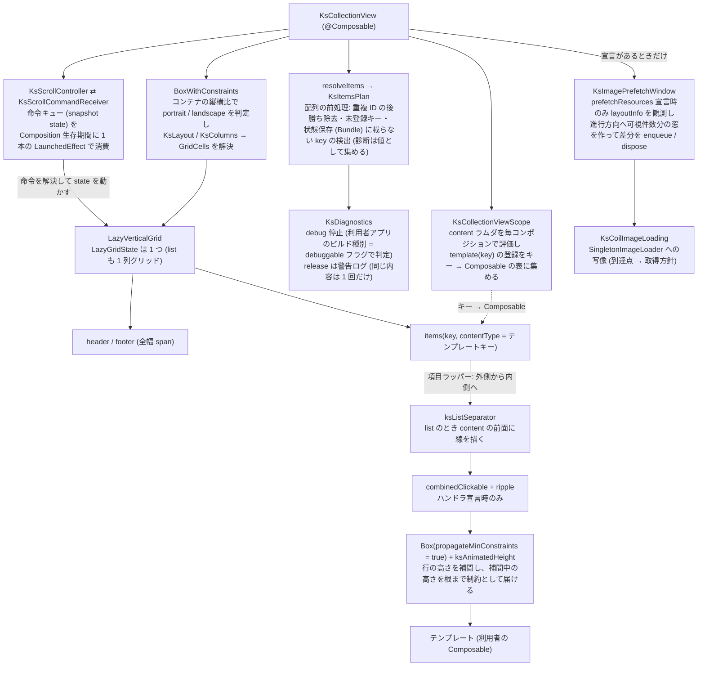

# Android Compose ラッパー

この文書を読むと、Android の `KsCollectionView` が Compose の Lazy 系にどう載っていて、core の契約 ([collection-items](../../core/core-model/collection-items.md) / [collection-layout](../../core/styling/collection-layout.md) / [collection-interaction](../../core/core-model/collection-interaction.md)) のどの部分をどの部品が担い、Compose のどの挙動を回避しているかが分かる。core の 3 文書を先に読むと分かりやすい。iOS の対応物は [iOS コレクションエンジン](../../ios/architecture/collection-engine.md)。

## 目的

Android は独自の描画エンジンを持たず、Compose Lazy 系の薄いラッパーである (core/ADR-0001)。ラッパーの仕事は、公開 DSL (スコープで集めたテンプレートと引数) を `LazyVerticalGrid` の DSL に流し込み、Compose がそのままでは満たさない core の契約 (不正入力の縮退・命令の順序保証・区切り線・content 配置・行の高さ変化) をその周りで成立させることに限る。iOS 側 (ios/ADR-0004) と同じく、独自のデータ保持層 (Store) や差分計算層を持たない。差分は Compose の `key` に委ねる。テンプレートのラムダは item の合成の中で実行されるため、そこで読んだ親の State は自動で購読され、iOS の `observedValue(_:)` に当たる指定は無い (ios/ADR-0008)。

## 構成

list も grid も同じ `LazyVerticalGrid` で描き、list は `GridCells.Fixed(1)` の 1 列グリッドである (android/ADR-0001)。`LazyColumn` は使わない。

## 責務境界

| 部品 | 責務 |
|---|---|
| `KsCollectionViewScope` (`@DslMarker`) | `template(key) { }` / `template { }` の登録をキー → `@Composable (Item) -> Unit` の表に集める。単一テンプレート形は、利用者からは見えない内部固定キーへの登録として同じ表に載る。同じキーへの二重登録は後勝ち (core/ADR-0011) |
| `resolveItems` / `KsItemsPlan` | `items()` に渡す前に配列を走査し、重複 ID を後勝ちで除去、未登録テンプレートキーと Bundle に載らない `key` を診断として集める。未登録キーの要素は最小高 1dp の空 item として残し件数を保つ。`contentType` にはテンプレートキーをそのまま渡す |
| `KsDiagnostics` | 診断を debug では `IllegalStateException` で止め、release では警告ログ (タグ `KsCollectionView`) にする。debug 判定は組み込み先アプリの debuggable フラグ。`WarnOnce` が同じ内容の警告を再コンポジションで繰り返さない |
| `KsLayout` / `KsColumns` | layout 値の値型。不正値 (0 以下の列数・負の spacing) の debug assertion。`GridCells` への変換は `BoxWithConstraints` で列数を決めてから行う |
| `ksListSeparator` (`KsListSeparator.kt`) | list のときだけ、各項目の前面 (`drawWithContent` で content 描画後) に先頭項目の上端と全項目の下端の線を全幅 1dp で描く。色は `listSeparatorColor` 未指定なら `#D9D9DE` |
| 項目のタップ | `onItemTap` / `onItemLongTap` のいずれかがあるときだけ `combinedClickable` で包む。indication は material3 の ripple (android/ADR-0003) |
| `ksAnimatedHeight` (`KsAnimatedHeight.kt`) | 行の高さ変化を補間し、補間中は content を現在の高さで測り直して描画を切り取る (android/ADR-0004)。content は上端固定・水平中央 (`Alignment.TopCenter` 相当。ios/ADR-0007 の規則) |
| `KsScrollController` / `KsScrollCommandReceiver` | 命令を receiver のキューに積み、コンポジション後に最新の配列で ID → index (ヘッダー分 +1 込み) を解決して `LazyGridState` を動かす。未接続 no-op、複数接続は最後勝ち、メインスレッド契約 |
| `KsImagePrefetchWindow` / `KsCoilImageLoading` | `LazyGridState.layoutInfo` を `snapshotFlow` で観測し、先頭可視 index の変化から進行方向を判定して「可視範囲の外側・進行方向・可視件数と同数」の窓を作る。「アイテム ID → URL」「URL → 参照数」の台帳の差分だけをローダーへ伝える。ローダー操作は internal な受け口 `KsImageLoading` に集め、本番は Coil の adapter、テストは記録用の fake を注入する |
| `KsImageRequestFactory` / `KsImageInvalidation` | `KsImage` の表示要求の組み立て (表示サイズ付きの鍵) と、キャッシュ消去の世代 (Compose の状態として持ち、読んでいる `KsImage` だけが組み立て直される) |
| `KsAppContext` / `KsAppContextInitializer` | androidx.startup の Initializer でアプリケーションのコンテキストを起動時に捕捉する。公開 API が `Context` を引数に取らないための経路 (android/ADR-0005)。未初期化なら `KsImageCache` は警告ログで no-op |

## 保証すること (実測で確かめた罠対策)

### 命令は 1 本の LaunchedEffect で消費し、配列更新で再起動しない

消費側は Composition の生存期間に 1 本だけ立てる `LaunchedEffect(receiver)` の coroutine で、`snapshotFlow` でキューの変化を待ち、命令を FIFO で 1 つずつ取り出して、その時点の最新の配列 (`rememberUpdatedState` 経由) で解決する。配列をキーにした `LaunchedEffect(items, …)` にすると配列更新のたびに実行中のアニメーションがキャンセルされ命令が消えうる。配列更新と命令が同じ再コンポジションで届くため、命令はコンポジション後に更新後の配列で解決される (core/ADR-0007 の「データ反映後に実行」)。

### Center / End は 1 回の命令に集約し、逆向きの補正を入れない

`animateScrollToItem(index, scrollOffset)` を 1 回だけ呼ぶ。`scrollOffset` は対象の高さの推定値 (可視なら実測、同じ `contentType` の可視項目の平均、無ければ可視項目全体の平均の順) から計算する。到着後の残差は、アニメーション時は進行方向と同じ向きで 4dp を超えるときだけ詰め、逆向きには補正しない。非アニメーション時は残差をそのまま詰める。「対象を先頭合わせで可視化してから `scrollBy` で中央へ寄せる」2 段階は、行き過ぎてから約 4 行分戻る動きになる。実機 A/B では、2 段階方式でスクロール方向が逆転するフレームが 15 あったのに対し、1 回集約では 0 になった。

### 区切り線は content の前面に描く

`drawBehind` (背面) では不透明な背景を持つテンプレートで線が 1 本も見えず、iOS 側 (区切り線は content の前面 — [iOS コレクションエンジン](../../ios/architecture/collection-engine.md)) と食い違う。`drawWithContent { drawContent(); … }` で content の後に描く。項目単位の描画は `LazyVerticalGrid` の再利用と両立し、行間に区切り線用の item を挿入する形 (項目数が倍になり index 解決が複雑化) を避けられる。

### 行の高さ変化は自前の補間で、補間中だけ測り直しと切り取りを行う

`animateContentSize` は子を新しい自然高で測ってから報告するサイズだけを補間するため、縮む向きで content の下端が先に飛び、区切り線との間にページ背景の帯が出る (約 240 ms)。`ksAnimatedHeight` は補間中の高さで content を測り直し、渡した制約に従わない content が行の外へ描かれないよう補間中だけ描画を切り取る。切り取りは描画時に行い合成レイヤは作らない。最初の測定では補間せず、再利用で直前の項目の高さを持ち越さない。`animateItem` は重ねない (中間フレーム数は変わらず性能の上乗せだけ残る)。

### 向きはコンテナ自身の縦横比で判定する

`LocalConfiguration.current.orientation` (端末の向き) は分割画面・タブレット・折りたたみでコンテナの縦横比と食い違い、iOS (`KsLayoutMetrics`) とずれる。`BoxWithConstraints` の `maxHeight > maxWidth` を portrait とする。独自 `GridCells` の `calculateCrossAxisCellSizes` には幅しか渡らず高さが取れないため使えない。

### 不正入力は Compose に届く前に縮退させる

Compose の Lazy 系は重複 `key` と Bundle に載らない `key` を例外にする。core/ADR-0011 の「落とさず・消さず・黙らず」を release で成立させるため、配列を `items()` に渡す前にライブラリが前処理する。診断は純粋な値として組み立ててから停止と報告に分け、再コンポジションのたびに同じ警告が繰り返されないようにする。

### 先読み窓は宣言があるときだけ観測する

`prefetchResources` が無いコレクションでは `snapshotFlow` の観測自体を起動しない (観測と集合差分はスクロール中の再コンポジション経路に乗るため)。窓の作り直しは可視範囲の変化ごとで、窓から可視範囲へ移った項目は取り消さず台帳に残す (表示側の読み込みへ引き継ぐ)。台帳の操作は錠で直列化する — `KsImageCache` が任意のスレッドから呼べ、消す前に先読み層の進行中の取得を止める (`KsImagePrefetchRegistry`) ため。既存の固定 fixture (「大量件数」、宣言なし) での回帰計測で、先読み窓の追加によるラッパーの上乗せは増えていない。

### 表示要求の鍵に表示サイズと当てはめ方を載せる

`KsImage` の表示要求は表示枠の実サイズを鍵に含め、同じ取得元でも表示サイズごとに別のキャッシュ項目になる。鍵に表示サイズを載せる付随情報の名前はローダー内部と同じ `coil#size` でなければならない — ローダーは鍵の表示サイズと要求の表示サイズが食い違う項目を捨てるため (逆アセンブルで確認。ローダーの版が上がると壊れうるが、壊れ方は「再デコードが増える」方向で表示は正しいまま)。当てはめ方の区別には自前の `ks#scale` を併用する (無いと fit の縮小結果が fill でも使われる)。表示枠は `BoxWithConstraints` で最初の構成で同期に読む (画像 1 枚あたり subcomposition が 1 段増える)。到達点 `memory` の先読みが載せた元寸は、画素を読み出せる場合だけその場で縮小して初回描画に使い (`KsDownscaleResult`)、読み出せない (ハードウェア支援ビットマップ) 場合は読み込み中からローダーの縮小デコードを待つ。ハードウェア支援を切って読めるようにする指定は採らない (載る画像も縮小結果もソフトウェアビットマップになり、描画のたびにテクスチャアップロードが乗る。実測でフレーム超過が 3 倍・メモリ定常値 +40 MB)。

### リソースはローダーを通さず同期で描く

`KsImageSource.Resource` は Coil ではなく `painterResource` で描く。Coil 経由では必ず一瞬読み込み中を経由し、「リソースは読み込み中を経由しない」契約を満たせない。読めないリソース ID (存在しない・drawable ではない・XML の読み取り失敗) は debug で停止、release は警告ログと失敗表示 (core/ADR-0011)。この帰結として `KsImageCache.remove(Resource)` は no-op になる。

### 仮想化と再利用が成立している

10,000 件で初期表示に評価されるテンプレートは可視範囲分 (22) だけで、400 項目を通過しても同時生存の最大は 32 に留まり、範囲外へ出た分は破棄される (Sample debug 構成のカウンタで実測)。配列を別の内容へ置換すると同時生存は可視範囲 + 先読み分に戻り、画面を離れると 0 になる (計測モジュールの自動走査で、先読みなし / `memory` / `disk` の 3 通りとも確認)。

スクロール性能の合否は、基準機でのオーナーの体感で下す (cross/ADR-0006。判定規則は [スクロール性能の体感ゲート](../../../handbook/cross/scroll-performance-gate.md))。文字だけの「大量件数」は体感合格で、iOS で問題になった推定高さの解き直しに相当する費用は無い (Lazy 系は表示中の項目だけを測るため)。この合格は固定の操作列を定める前の記録 (2026-09-08) で、固定の操作列での採り直しは Android 本体に触れる次の変更で行う。画像グリッドの体感と表示待ちは [image-loading](../../core/core-model/image-loading.md) の性能節にある。

体感とは別の系統で、比較対象 (ライブラリを通さない素の `LazyVerticalGrid` / `LazyColumn` の画面) に対する上乗せを Macrobenchmark で測る。事後検証スクリプトが、各試行の描画フレーム数が 90 以上であることと、`frameDurationCpuMs` の P90 / P99 の劣化が 10% 以内であることを判定する。2026-09-15 の基準機では、2 列グリッド・1 列リストともライブラリ側が比較対象より 6〜9% 速かった。ただし比較対象だけが `animateContentSize` の合成レイヤを負う条件なので、この結果はラッパーの薄さそのものの証明にはならない。手順は [Android 性能検証の手順](../../../handbook/android/performance-verification.md)。

## してはいけないこと

- list を `LazyColumn` で描かない。`LazyGridState` と別の state になり、切替でスクロール位置が失われ `KsScrollController` の接続が 2 経路になる (android/ADR-0001)。
- content ラムダを `remember` して初回だけ評価しない。親の state を捕捉したテンプレートが更新されず、iOS (ios/ADR-0006) と食い違う。評価コストは登録数に比例するだけ。
- スクロール命令の消費を配列をキーにした `LaunchedEffect` にしない (上記)。
- 項目に `animateItem` を重ねない (上記)。
- 計測用画面・テンプレート計数を release のソースセットに置かない。Sample の `measurement` / `counterEnabled` ソースセットの差し替えで release には空実装だけが入る。
- 画像の要求にハードウェア支援ビットマップを使わない指定 (`allowHardware(false)`) を付けない。クラッシュ対策であっても、描画資源を切る回避策は実装側で選ばずオーナーに諮る (上記「表示要求の鍵」)。
- 公開 API に `Context` を引数で足さない。`KsAppContext` から読む (android/ADR-0005)。

## 用語

- **前処理 (`resolveItems`)**: 利用者の配列を Compose に渡す前に不正入力を縮退させる走査。
- **receiver**: `KsScrollController` の接続先となる Composable 内部の状態オブジェクト。命令キューを持つ。
- **補間中**: `ksAnimatedHeight` が行の高さを目標値へ向けて動かしている区間。この間だけ content の測り直しと切り取りが働く。
- **比較対象**: 性能の相対基準で突き合わせる、ライブラリを通さない素の `LazyVerticalGrid` / `LazyColumn` の画面 (Sample の計測用ソースセット)。
- **Sample**: リポジトリ同梱 (`samples/android/`) の動作確認・パリティ検証用アプリ。計測用画面・テンプレート計数は debug / 計測構成のソースセットにだけ実体がある。
- **受け口 (`KsImageLoading`)**: ローダーへの操作を集めた internal な境界。本番は Coil の adapter、テストは記録用の fake が入る。

## 関連

- [collection-items](../../core/core-model/collection-items.md) — 実現している契約 (項目モデル・不正入力)
- [collection-layout](../../core/styling/collection-layout.md) — 実現している契約 (layout 値・区切り線・content 配置・行の高さ変化)
- [collection-interaction](../../core/core-model/collection-interaction.md) — 実現している契約 (タップ・スクロール命令)
- [image-loading](../../core/core-model/image-loading.md) — 実現している契約 (先読み・到達点・KsImage・キャッシュ操作)
- [iOS コレクションエンジン](../../ios/architecture/collection-engine.md) — 同じ契約の iOS 側の実現
- [Android 性能検証の手順](../../../handbook/android/performance-verification.md)、[スクロール性能の体感ゲート](../../../handbook/cross/scroll-performance-gate.md) — 性能の手順と合否の判定規則 (cross/ADR-0006)
- android/ADR-0001 (LazyVerticalGrid 統一)、android/ADR-0002 (単一モジュールと版方針。Coil は利用者の compileSdk 要求を上げない 3.5.0 に固定)、android/ADR-0003 (material3 と ripple)、android/ADR-0004 (行の高さ変化の補間)
- android/ADR-0005 (アプリケーションコンテキストの捕捉)、core/ADR-0012 (Coil への直接依存と共有インスタンス)
- core/ADR-0007、core/ADR-0011、ios/ADR-0007
