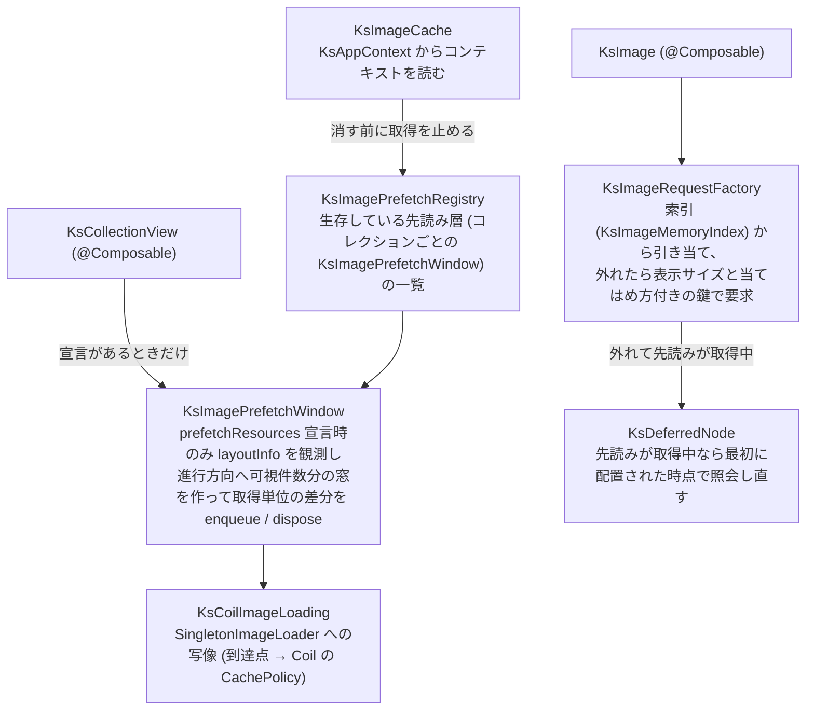

# Android 画像の先読みと KsImage の実現

この文書を読むと、[画像の先読みと KsImage](../../core/core-model/image-loading.md) の契約を Android 側がどの部品で実現し、Coil と Compose のどの性質を回避するために先読み窓・メモリの鍵 (`MemoryCache.Key`) の付随情報 (extras)・画面に出る時点の照会し直しを持っているかが分かる。利用者から見た契約 (宣言の形・到達点・許容範囲・キャッシュ操作の意味・プラットフォーム差) は core の文書が正で、この文書はその Android 側の実現だけを扱う。core の文書と、コレクション本体の部品構成を述べた [Android Compose ラッパー](compose-wrapper.md) を先に読むと分かりやすい。iOS の対応物は [iOS 画像の先読みと KsImage の実現](../../ios/architecture/image-pipeline.md)。

## 構成

## 責務境界

| 部品 | 責務 |
|---|---|
| `KsImagePrefetchWindow` / `KsCoilImageLoading` | `LazyGridState.layoutInfo` を `snapshotFlow` で観測し (lazy の index は `KsGroupPlan` で項目の位置へ写す)、先頭可視 index の変化から進行方向を判定して「可視範囲の外側・進行方向・可視件数と同数」の窓を作る。「アイテム ID → 宣言 (識別子・URL・幅の種類) と取得単位」「取得単位 → 参照数と開始時の取っ手 (取り消し用の `KsImageRequestHandle`)」の 2 層の台帳の差分だけをローダーへ伝える。列幅は `update` のたびに layout・contentPadding・コンテナ幅から解く (`Adaptive` は `LazyVerticalGrid` の規則を再現)。ローダー操作は internal な受け口 `KsImageLoading` に集め、本番は Coil の adapter、テストは記録用の fake を注入する |
| `KsImageRequestFactory` / `KsImageIdentity` / `KsImageInvalidation` | `KsImage` の引き当てと表示要求の組み立て (表示サイズと当てはめ方付きの鍵)、識別子 (キーまたは URL) と鍵の算出、キャッシュ消去の世代 (Compose の状態として持ち、読んでいる `KsImage` だけが組み立て直される) |
| `KsImageMemoryIndex` / `KsImageMatching` | 引き当ての候補になる `MemoryCache.Key` の索引 (1 つの錠で直列化した LRU、上限 20,000 件) と、取得中の先読みの記録 (取得 1 件ごとの目印。`hasFetchInFlight` の判定に使う) と、許容範囲の判定 (定数 0.5 / 4 はここに 1 か所) |
| `KsDeferredNode` | 合成で引き当てに外れ、先読みが取得中のときだけ置く描画部品。最初に配置された時点で照会し直す (後述) |
| `KsImageCache` / `KsImagePrefetchRegistry` | 公開のキャッシュ操作 (`clear` / `remove`) の実装と、生存している先読み層の一覧。消す前に一覧を通じて先読みの進行中の取得を止める |
| `KsAppContext` / `KsAppContextInitializer` | androidx.startup の Initializer でアプリケーションのコンテキストを起動時に捕捉する。公開 API が `Context` を引数に取らないための経路 (android/ADR-0005)。未初期化なら `KsImageCache` は警告ログで no-op |

## 保証すること

### 先読み窓は宣言があるときだけ観測する

`prefetchResources` が無いコレクションでは `snapshotFlow` の観測自体を起動しない (観測と集合差分はスクロール中の再コンポジション経路に乗るため)。窓の作り直しは可視範囲の変化ごとで、窓から可視範囲へ移った項目は取り消さず台帳に残す (表示側の読み込みへ引き継ぐ)。台帳の操作は錠で直列化する — `KsImageCache` が任意のスレッドから呼べ、消す前に先読み層の進行中の取得を止める (`KsImagePrefetchRegistry`) ため。先読みを宣言しない既存の計測画面 (「大量件数」) で回帰を測り、先読み窓を足しても素の `LazyVerticalGrid` に対するフレーム時間の上乗せは増えていない。

### 表示要求の鍵に表示サイズと当てはめ方を載せる

`KsImage` の表示要求は `size` + `Precision.EXACT` と、表示枠の実サイズと当てはめ方を載せたメモリの鍵で出し、同じ取得元でも表示サイズごとに別のキャッシュ項目になる。鍵に表示サイズを載せる付随情報の名前はローダー内部と同じ `coil#size` でなければならない — ローダーは鍵の表示サイズと要求の表示サイズが食い違う項目を捨てるため (逆アセンブルで確認。ローダーの版が上がると壊れうるが、壊れ方は「再デコードが増える」方向で表示は正しいまま)。

当てはめ方 (fit / fill) は自前の `ks#scale` で表示要求の鍵にだけ載せる。無いと、引き当てで範囲外と退けた先読みの項目や別の当てはめ方で載った項目が、ローダーのメモリで表示要求と同じ鍵に当たる。幅つきの先読みは `coil#size` だけの鍵 (`Scale.FILL` + `Precision.INEXACT`) で載せ、幅なしの先読みは鍵に付随情報を付けない。キーを指定した画像は鍵の本体と `diskCacheKey` が識別子 (`"ks-key " + key`) になり、削除の世代は鍵に入れない (iOS と違い、Android はソースの世代を鍵に混ぜない。core/ADR-0014)。表示枠は `BoxWithConstraints` で最初のコンポジションで同期に読む (画像 1 枚あたり subcomposition が 1 段増える)。

### 範囲内のメモリ項目は要求を出さずに描く

Coil の `Precision.INEXACT` (要求の寸法以上なら再利用する。比の下限 1.0・上限なし) は許容範囲と合わず、`memoryCache.keys` の走査は件数に比例するため、引き当ては Coil に任せず KsCollectionView 側で行う (core/ADR-0013)。`KsImageMemoryIndex` が識別子ごとに `MemoryCache.Key` を覚え、`KsImageRequestFactory` が候補をローダーのメモリキャッシュへ問い合わせて `KsImageMatching` で判定する。範囲内なら `rememberAsyncImagePainter` を作らず、その項目を `Image` で描く。

先読みが載せた元寸はハードウェア支援ビットマップのまま使え、CPU で画素を読む縮小はしない。ハードウェア支援を切って読めるようにする指定は採らない (載る画像も縮小結果もソフトウェアビットマップになり、描画のたびにテクスチャアップロードが乗る。実測でフレーム超過が 3 倍・メモリ定常値 +40 MB)。

### 先読みが取得中なら、画面に出る時点で照会し直してから要求する

フリング中の Compose は画面外の項目を先に合成するため、合成の時点では先読みが未完了で、画面に出る頃には完了していることがある。合成の時点で要求を出すと、その項目は読み込み中を経由してディスクから再デコードする。そこで、合成で引き当てに外れ、同じ識別子の到達点 `memory` の先読みが取得中 (`hasFetchInFlight`) のときだけ、部品 `KsDeferredNode` が最初に配置された時点で照会し直す。当たればその項目を、外れればその場で出した要求の結果を部品の中で描き、再合成はせず描画の無効化だけで済ませる (状態を書いて再合成する形では、表示中のフレームの再合成が増えて janky frames (フレーム超過) が悪化した)。

取得中は取得 1 件ごとの目印で数え、完了・失敗・取り消しのリスナーと、取っ手 (`KsImageRequestHandle.dispose()`) による取り消しで外れる。そのため、完了・失敗・取り消し済みの先読みの画像は遅らせず、合成の時点ですぐに要求を出す。

### リソースはローダーを通さず同期で描く

`KsImageSource.Resource` は Coil ではなく `painterResource` で描く。Coil 経由では必ず一瞬読み込み中を経由し、「リソースは読み込み中を経由しない」契約を満たせない。読めないリソース ID (存在しない・drawable ではない・XML の読み取り失敗) は debug で停止、release は警告ログと失敗表示 (core/ADR-0011)。この帰結として `KsImageCache.remove(Resource)` は no-op になる。

## してはいけないこと

- 画像の要求にハードウェア支援ビットマップを使わない指定 (`allowHardware(false)`) を付けない。ハードウェアビットマップを CPU で読もうとして落ちるクラッシュへの対策であっても、ハードウェア支援を切る回避策は実装側で選ばずオーナーに諮る (上記「範囲内のメモリ項目は要求を出さずに描く」)。
- 公開 API に `Context` を引数で足さない。`KsAppContext` から読む (android/ADR-0005)。

## 用語

- **受け口 (`KsImageLoading`)**: ローダーへの操作を集めた internal な境界。本番は Coil の adapter、テストは記録用の fake が入る。
- **到達点 / 識別子 / 索引 / 引き当て / 取得単位 / 幅の種類 / 許容範囲 / 鍵 / 世代**: 意味は [画像の先読みと KsImage](../../core/core-model/image-loading.md) の用語節。
- **ローダー**: 画像の取得・デコード・キャッシュを行う本体。Android では Coil の `SingletonImageLoader` が返す共有インスタンス。
- **取っ手**: 取得を開始したときに受け口が返す `KsImageRequestHandle`。`dispose()` で取得を取り消す。

## 関連

- [画像の先読みと KsImage](../../core/core-model/image-loading.md) — 実現している契約 (先読み・到達点・KsImage・キャッシュ操作)
- [Android Compose ラッパー](compose-wrapper.md) — 先読み窓が観測するコレクション本体の部品構成と `KsGroupPlan` の写像
- [iOS 画像の先読みと KsImage の実現](../../ios/architecture/image-pipeline.md) — 同じ契約の iOS 側の実現
- android/ADR-0002 (版方針。Coil は利用者の compileSdk 要求を上げない 3.5.0 に固定)、android/ADR-0005 (アプリケーションコンテキストの捕捉)
- core/ADR-0012 (Coil への直接依存と共有インスタンス)、core/ADR-0013・0014 (許容範囲の引き当て・任意キー)、core/ADR-0011 (不正入力)
