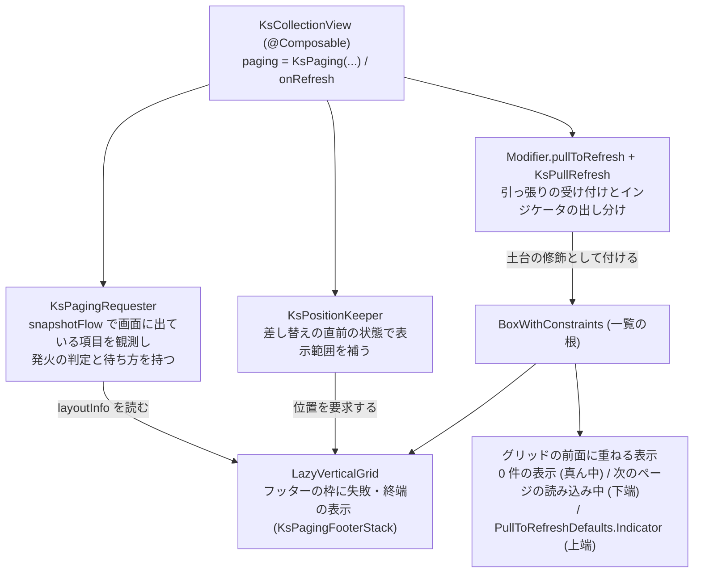

# Android ページングと Pull to Refresh の実現

この文書を読むと、[ページングと Pull to Refresh](../../core/core-model/collection-paging.md) の契約を Android 側がどの部品で実現し、Compose と material3 のどの挙動を避けているかが分かる。契約の文書と、一覧全体の仕組みを書いた [Android Compose ラッパー](compose-wrapper.md) (`KsGroupPlan`・`KsPositionKeeper`・`KsTopSafeArea`) を先に読むと分かりやすい。iOS の対応物は [iOS ページングと Pull to Refresh の実現](../../ios/architecture/paging-engine.md)。

## 構成

## 責務境界

| 部品 | 責務 |
|---|---|
| `KsPagingRequester` / `KsPagingItemsVersion` (`KsPagingRequester.kt`) | 発火の式・しきい値の検査・待ち方の控え・再試行・取り消しを、UI から切り離して持つ。配列の版は、配列の参照が変わった回だけ中身を比べて進める |
| `KsPaging` / `KsPagingDisplay` (`KsPaging.kt` / `KsPagingDisplay.kt`) | ページングの設定の公開型と、状態と 0 件かどうかから出す表示を決める内部の列挙。失敗・終端の表示は `KsPagingFooterStack` でフッターの枠の中に置く |
| `KsPullRefresh` (`KsPullRefresh.kt`) | 引っ張って始めた取り直しの進み具合と、インジケータを出すかどうか (core/ADR-0023)。取り直しの世代を持ち、取り消した処理が後から終わっても、世代の番号で見分けて後の取り直しの印を下ろさない |
| `ksBlockingTouches` | 差し替えた「次のページの読み込み中」の表示の範囲で、下の項目へのタップを止め、範囲から始めた縦のドラッグを一覧のスクロールに渡す (下記) |
| `KsPositionKeeper` | 端への挿入の判定 (`keepEdge`) に、差し替えの直前のページングの状態と Pull to Refresh の取り直しの間かを足す (下記) |
| `KsTopSafeArea` | 上端・下端の安全領域との重なり (`overlapPx` / `bottomOverlapPx`) を、インジケータ・0 件の表示・次のページの読み込み中の位置に使う (下記) |

## 保証すること (実測で確かめた罠対策)

### 判定の材料は snapshotFlow で観測する (core/ADR-0020)

画面に出ている項目は、`LaunchedEffect(gridState, pagingRequester)` の中で `snapshotFlow` により `layoutInfo.visibleItemsInfo` を観測し、`KsGroupPlan.itemIndexOfLazy` で項目の添字に直して数える。見出し・ルートのヘッダー / フッターは -1 になって除かれる (画像の先読みの `visibleItemRange` (`KsImagePrefetchWindow.kt`) と同じ取り方)。フッターの枠 (失敗・終端の表示) も lazy の項目だが、項目としては数えない。

状態・しきい値・配列の版・処理の実行中の印 (`KsPagingRequester.isRunning` は snapshot state) も同じ流れの入力にしているため、スクロールに加えて、配列・状態・しきい値の変化と処理の終わりで判定し直す。状態と配列の版は、判定とは別に毎回のコンポジションの `SideEffect` で requester に知らせ、待ち方の控えを捨てる機会を逃さない。ページングを付けていない一覧では観測しない。

### 表示の置き場 (core/ADR-0024)

| 表示 | 置き方 |
|---|---|
| 次のページの失敗 / 終端 | フッターの枠 (`KsRootSlotKey.Footer` の全幅の項目) の中に `KsPagingFooterStack` で、利用者のフッターの上に置く。ページングを付けた一覧では利用者のフッターが無くても枠を置き、`KsGroupPlan` の行の数え方でも 1 行として数える |
| 次のページの読み込み中 | `BoxWithConstraints` の中でグリッドの前面 (`zIndex(1f)`) に `AnimatedVisibility` で重ね、`BottomCenter` から「`bottomOverlapPx` + 8dp」上げる。出入りは 200 ms のフェード。既定の表示は `CircularProgressIndicator` を 24dp・線 2.5dp に小さくしたもの |
| 0 件の 3 つ | グリッドの前面 (`zIndex(1f)`) に `matchParentSize` の箱を重ね、`ksExcludingVerticalSafeArea` で上下の安全領域を除いた範囲の中央に置く。箱自体はタッチを受けない |

消えるフェードの間も同じ表示を描き続けるため、表示の中身は `rememberUpdatedState` で最後の中身を持つ。専用の lazy の項目を足さずフッターの枠に置くのは、既存の数え方を変えずに済むためである。足すと、`KsGroupPlan` が持つ全件数と行の数、項目の種類 (contentType) の見積もり、構成表が等しいかの比較とそれを使う remember のキーを直す必要があり、`KsRootSlotKey` が Header / Footer の 2 値だけを持つ前提も崩れる。

### 重ねた表示から始めたドラッグは一覧へ渡す

差し替えた「次のページの読み込み中」の表示は、押せる部品を持たなくても範囲のタップを止める必要がある (下の項目を誤って押させない)。`pointerInput` でイベントを受けるだけにすると、範囲から始めたドラッグで一覧が動かない。`ksBlockingTouches` は `scrollable(gridState)` を付けてドラッグを一覧のスクロールにし、向き (`ScrollableDefaults.reverseDirection`)・慣性を一覧と同じにする。

`scrollable` を付けるだけでは、一覧のスクロールインジケータは出ず、端での伸び (オーバースクロール) も付かない。スクロールインジケータは `gridState.interactionSource` のドラッグを見て利用者のスクロールと判定するが、重ねた表示のドラッグはそこに現れないためである。そこで端の効果は `rememberOverscrollEffect()` の同じ実体を `LazyVerticalGrid` と `scrollable` の両方に渡し、ドラッグの知らせは別の `MutableInteractionSource` (`overlayDragInteractions`) に出して `ksScrollIndicator` にも読ませる。

### 差し替えの位置の保ち方にページングの状態を足す (core/ADR-0021)

端への挿入は、`KsPositionKeeper.onUpdate` が配列の参照が変わった回に `keepEdge` で判定して補う ([Android Compose ラッパー](compose-wrapper.md) の「端を表示中の端への挿入は位置を補う」)。`onUpdate` は前回の配列と同じく前回のページングの状態を控え、`keepEdge` が次の条件を先に見る。

| 条件 | 補い方 |
|---|---|
| Pull to Refresh の取り直しの間、または直前の状態が取り直し中 | 位置によらず `requestScrollToItem(0)` で先頭を要求する |
| ページングを付けた一覧で、0 件から項目が届いた | 先頭を要求する。0 件でもフッターの枠を置くため、既定の位置の保ち方では表示範囲の先頭にあった枠を保とうとして、届いた最初のページの末尾に着地する |
| 末尾を表示中の末尾への挿入で、直前の状態が終端以外 | 末尾へ送らない。見えている先頭の項目を保つ既定のままにし、届いたページは今の位置の下に現れる |

判定は配列の参照が変わった回だけ行うため、取り直しが失敗して VM が同じ配列のまま状態を戻したときは位置を動かさない (取り直しの間に下へスクロールしていればその位置に残る。iOS との差として受け入れた)。

### Pull to Refresh は引っ張りの修飾とインジケータを別に組む (core/ADR-0023)

material3 1.4.0 の `PullToRefreshBox` には引っ張りを受け付けない設定が無い。そこで一覧の根の `BoxWithConstraints` に土台の修飾 `Modifier.pullToRefresh(isRefreshing, state, enabled, onRefresh)` を付け、`PullToRefreshDefaults.Indicator` を上端の中央 (`zIndex(2f)`) に別に重ねる。`enabled` は「状態が追加読み込み中でなく、次ページ要求の処理も実行中でない」とき。

`KsTopSafeArea` の測り方の修飾 (`topSafeArea.modifier`) は、付けた位置の一覧の根の位置と大きさで安全領域との重なりを測る。土台の修飾はその後ろ (内側) に付け、測る対象の位置と大きさが Pull to Refresh の有無で変わらないようにする。インジケータは `overlapPx` の分だけ下げる。インジケータは置いた位置の上端より上を描かない (上端で描画が切り取られる) ため、引っ張り始めは安全領域の境目の下に上から現れる。

取り直しの処理の中で書き換えた状態は、処理が終わった時点ではまだコンポジションに届いていない。そのためインジケータを消すかどうかは、処理の終わりを反映したコンポジションの `SideEffect` で `KsPullRefresh.finishIfDone` が決める。位置の保ち方 (`KsPositionKeeper`) に渡す「取り直しの間か」は、同じコンポジションで `finishIfDone` がインジケータを消す前の値を控えて渡す。そのため、取り直しの終わりと同じ回に届いた差し替えも、取り直しの間の差し替えとして先頭から表示される。

### 重ねる表示の安全領域 (core/ADR-0025)

`KsTopSafeArea.bottomOverlapPx` は、上端の `overlapPx` と同じ求め方で下端の重なりを求める。祖先が消費した分を除いた insets の下端と、コレクションの下端を、どちらもウィンドウの座標で突き合わせる。`ComposeView` を画面の一部に置き、その下端がウィンドウの下端に届かない置き方では、重なりは 0 になる。0 件の表示は上下の両方を、次のページの読み込み中は下端を使う。

### 処理の寿命

次ページ要求と取り直しの処理は、一覧の `rememberCoroutineScope` で起動する。一覧がコンポジションを離れるとスコープごと取り消され、`KsPagingRequester` は `DisposableEffect` でも取り消す。取り消した処理が後から終わっても (取り消しを握りつぶして戻った場合を含む)、世代の番号で見分けて後の処理の実行中の印を下ろさない。処理が投げた例外はライブラリが捕まえないため、失敗は利用者の VM の中で状態にする。

## してはいけないこと

- Pull to Refresh を `PullToRefreshBox` で組まない。追加読み込みの間に引っ張りを止められない (上記)。
- 一覧に重ねた表示でタップを止めるのに、`pointerInput` だけを付けない。範囲から始めたドラッグで一覧が動かない。`scrollable` を付けるときは、端の効果とドラッグの知らせを一覧と共有する (上記)。
- ページングの表示のために専用の lazy の項目を足さない。`KsGroupPlan` の数え方とキーの前提が崩れる (上記)。
- インジケータを消す判定を、取り直しの処理が終わった直後の coroutine の中で行わない。処理の中で書き換えた状態がまだコンポジションに届いておらず、古い状態で判定してしまう (上記)。

## 性能

「ページング」画面 (10,000 件・1 ページ 50 件・取得の遅延 200 ms、list) は基準機 Pixel 4a で体感合格で、期限超過は 12 枚 (0.66%)、フレーム時間の P99 34 ms だった (2026-09-29、[証跡](../../../changes/archive/2026-09-29-paging-state-machine/evidence/perf-android-paging.md))。ページングは既定機能ではないため、比較対象 (素の `LazyVerticalGrid`) との相対計測は行っていない。判定規則は [スクロール性能の体感ゲート](../../../handbook/cross/scroll-performance-gate.md)。

## 用語

- **フッターの枠**: ルートのフッターを置く全幅の lazy の項目 (`KsRootSlotKey.Footer`)。ページングを付けた一覧では利用者のフッターが無くても置き、失敗・終端の表示を利用者のフッターの上に並べる ([collection-paging](../../core/core-model/collection-paging.md) の用語)。
- **構成表 (`KsGroupPlan`)**: グループの境目・見出しの有無から作る、項目の位置と lazy の index の対応表と行の数え方 ([Android Compose ラッパー](compose-wrapper.md) の用語)。
- **配列の版**: ページングを付けた一覧で、配列の中身が変わるたびに 1 進む数 (`KsPagingItemsVersion`)。頼んだ後の待ち方を解く目印に使う。
- **待ち方の控え**: 次ページ要求を頼んだ時点の状態と配列の版。どちらかが変わったのを見たら捨て、捨てるまで次を頼まない。
- **実行中の印**: 次ページ要求 / 取り直しの処理が終わっていないことを表す値 (`isRunning` など)。実行中は次を頼まず、引っ張りも受け付けない。
- **世代**: 処理を起動するたび (と取り消したとき) に 1 進む番号。後から終わった古い処理を見分け、新しい処理の印を下ろさないために使う。
- **土台の修飾**: material3 の `Modifier.pullToRefresh`。引っ張りの受け付けだけを持ち、インジケータは別に置く。

## 関連

- [ページングと Pull to Refresh](../../core/core-model/collection-paging.md) — 実現している契約
- [Android Compose ラッパー](compose-wrapper.md) — `KsGroupPlan`・端への挿入 (`KsPositionKeeper`)・`KsTopSafeArea`・スクロールインジケータ
- [iOS ページングと Pull to Refresh の実現](../../ios/architecture/paging-engine.md) — 同じ契約の iOS 側の実現
- core/ADR-0020 (発火の条件)、core/ADR-0021 (表示範囲の置き方)、core/ADR-0022 (待ち方)、core/ADR-0023 (Pull to Refresh)、core/ADR-0024 (6 つの表示)、core/ADR-0025 (重ねる表示と安全領域)
- core/ADR-0017 (安全領域)、android/ADR-0001 (LazyVerticalGrid 統一)、cross/ADR-0006 (性能の完了判定)
