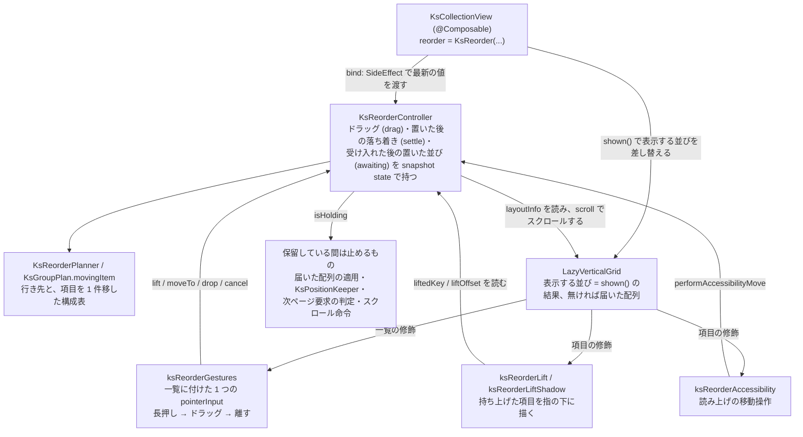

# Android 並べ替えの実現

この文書を読むと、[並べ替え](../../core/core-model/collection-reorder.md) の契約を Android 側がどの部品で実現し、Compose の Lazy 系のどの挙動を避けているかが分かる。契約の文書と、一覧全体の仕組みを書いた [Android Compose ラッパー](compose-wrapper.md) (`KsGroupPlan`・項目の修飾の順・`KsPositionKeeper`) を先に読むと分かりやすい。iOS の対応物は [iOS 並べ替えの実現](../../ios/architecture/reorder-engine.md)。

## 構成

Compose には Lazy 系の公式の並べ替えの API が無いため、長押しの検出から置いた後の表示まで、Compose の公開 API の上に自前で組む。OSS には依存も取り込みもしない (android/ADR-0007)。



並べ替えの修飾は、項目の修飾の順 ([Android Compose ラッパー](compose-wrapper.md) の構成) の中で次の位置に入る (外側から内側へ)。`animateItem` を付ける項目の入れ物が `KsAnimatedItemBox` である。

```
animateItem (持ち上げた項目は配置のアニメーションを外す)
  → ksReorderLift (項目全体を指の下へずらし、手前に描く)
  → ksAppearance → 幅 → ksItemSpacing (行間・グループ間の間隔)
  → ksReorderLiftShadow (間隔の内側にだけ影)
  → ksListSeparator → ksReorderAccessibility → combinedClickable → ksAnimatedHeight → テンプレート
```

## 責務境界

| 部品 | 責務 |
|---|---|
| `KsReorderController` (`KsReorderController.kt`) | 一覧 1 つ分の並べ替えの状態。持ち上げ (`lift`)・指の移動 (`moveTo`)・行き先の求め直し (`retarget`)・指を離したときの処理 (`drop`)・取りやめ (`cancel`)・自動スクロール・読み上げの操作の実行を持ち、表示する並びを `shown()` で返す。利用者の配列は書き換えない |
| `KsReorderDrag` / `KsReorderSettle` / `KsReorderAwait` | ドラッグ 1 回の状態 (持ち上げたときの並びと構成表・指の位置・今の行き先・行き先の求め方)、置いた後に置き場所へ落ち着かせる動き、受け入れた後に VM の配列を待つ間の置いた並び |
| `KsReorderBinding` | ラッパーが毎コンポジションの後に渡す最新の値 (届いた配列・表示中の並び・構成表・layout 値・列数・並べ替えの設定) |
| `ksReorderGestures` | 一覧の `pointerInput` で長押しとドラッグを受け、controller を呼ぶ (下記) |
| `KsReorderPlanner` / `KsReorderPlacement` (`KsReorderPlanner.kt`) | 「あるグループの中の、動かした項目を除いた何番目」から行き先を求める。元の位置・1 つ前 / 1 つ後ろの行き先、置いた後の位置、項目を移した後の構成表も求める。表示を知らない |
| `KsReorderedList` | 配列の 1 件を別の位置へ動かした並びを、写しを作らずに表すリスト |
| `KsGroupPlan.movingItem` (`KsGroupPlan.kt`) | 項目 1 件を別のグループへ移した構成表。グループの値からは組み直さず、各グループの件数だけを変える |
| `ksReorderLift` / `ksReorderLiftShadow` (`KsReorderLift.kt`) | 持ち上げた項目を指の下にずらして手前に描く層と、影だけを付ける層 (下記) |
| `ksReorderAccessibility` / `ksReorderAccessibilityTargets` | 読み上げの操作を項目の semantics に付けることと、前へ / 後ろへを出せるかの判定 |
| `KsGroupDeclaration` | グループの宣言 (公開の `KsGroups`) を比べるための写し。グループの値のラムダ・見出しの有無・見出しを固定するかどうかを持ち、ドラッグ中に宣言が変わったかを比べる |

## 保証すること (実測で確かめた罠対策)

### ジェスチャは一覧に付けた 1 つの pointerInput で受ける (core/ADR-0031)

長押しとドラッグは、項目ごとではなく `LazyVerticalGrid` の修飾に付けた 1 つの `pointerInput` で受ける (`reorder` を渡した一覧にだけ付ける)。指の位置を一覧の座標で持つためで、ドラッグ中に項目が入れ替わっても指の位置がずれない。

| 段階 | 受け方 | 呼ぶ処理 |
|---|---|---|
| 長押しを待つ間 | 子 (項目のタップ・一覧のスクロール) と同じ段 (既定の `PointerEventPass.Main`) で見る。`longPressTimeoutMillis` が経つ前に、指が `touchSlop` を越えて動いた・離れた・別の指が触れたら長押しにしない。一覧のスクロールと取り合わない | 成立したら `lift` |
| 持ち上げた後、指が動く | 子より先の段 (`PointerEventPass.Initial`) でタッチを消費し、一覧のスクロールと項目のタップを起こさない | `moveTo` (中で `retarget`) |
| 指を離した | 同上 | `drop` |
| 指の情報が届かなくなった・操作が途中で打ち切られた | — | `cancel` |

持ち上げ (`lift`) は、並べ替えのスイッチが有効で、ドラッグも落ち着きの動きも進んでおらず、`canMove` が偽でない項目でだけ成り立つ。長押しの位置に見出しやルートのヘッダー / フッターが重なっていれば持ち上げない (それらは項目より手前に描かれるため)。持ち上げたときに触覚 (`HapticFeedbackType.LongPress`) を返す。

並べ替えのスイッチが有効の間は、項目の `combinedClickable` に `onLongClick` を渡さない。`onItemTap` が無ければ、`onItemLongTap` を宣言していても `combinedClickable` 自体を付けないので、タップのフィードバックも出ない。

### 仮の並びは写しを作らず、構成表は件数だけを動かす (core/ADR-0026・0029)

ドラッグ中は行き先が変わるたびに並びを作り直すため、件数に比例する写しを作らない。`KsReorderedList` が「持ち上げたときの並びの 1 件を別の位置へ動かした並び」を添字の読み替えだけで表す。

動かした項目のグループの値は、VM の配列が届くまで古いままである。そこで構成表はグループの値から組み直さず、`KsGroupPlan.movingItem` で各グループの件数だけを変える。ドラッグ中は項目が無くなったグループも残し (見出しが残り、元のグループへ戻せる)、受け入れた時点で取り除く。

表示する並びは `shown()` が上の行から順に決める。

| 条件 | `shown()` が返す並び |
|---|---|
| ドラッグの状態 (`drag`) があり、取りやめておらず、行き先が元の位置と違う | 仮の並び (持ち上げたときの並びで、項目を今の行き先へ動かした並びと構成表) |
| ドラッグの状態があり、行き先が元の位置・取りやめた・取りやめの原因になる変化 (下記「保留している間は…」) が届いた回 | 持ち上げたときの並び |
| ドラッグの状態が無く、受け入れた後の待ち (`awaiting`) があり、届いた配列が受け入れた時点の配列と等しく (同じ参照か同値)、グループの宣言の形も変わっていない | 置いた並び |
| それ以外 | 無し (届いた配列をそのまま表示する) |

取りやめた後や指を離した後も、項目が元の位置へ戻り終えるまではドラッグの状態が残る。

### 行き先は、持ち上げた項目の位置から決める (core/ADR-0028・0029)

指の位置から求めるのは行き先 (どのグループの、どの項目の前か、または末尾か) である。行き先が変わると仮の並びが変わり、画面に見える置き場所 (持ち上げた項目が入る空き) が動く。下の表で「数える」は、表示範囲にある項目・見出しを、行き先を決める相手に含めることを指す。

| layout 値 | 行き先の決め方 |
|---|---|
| list | 持ち上げた項目の上端 (指の位置からつかんだ位置を引く) を求める。表示範囲の項目から今の置き場所を取り除いて上へ詰めたと見なし、持ち上げた項目の上端より下に中心がある最初の項目の前を行き先にする |
| グリッド | 指の下にある項目 (相手) の位置へ、持ち上げた項目を入れる。仮の並びの中で、相手が持ち上げた項目より後ろにあれば相手の後ろ、前にあれば相手の前を行き先にする。行の最後の項目より右の空きは、その項目の後ろ |

list を「指の下の項目の上半分なら前、下半分なら後ろ」で決める形は採らない。つかんだ位置が項目の中ほどだと、持ち上げた項目がほかの項目にほぼ重なっても入れ替わらず、置き場所が離れた位置に残った。今の形では、持ち上げた項目がほかの項目の半分を越えて重なったら入れ替わる。詰めたと見なした並びは置き場所の位置によらず変わらないので、指が止まっている間に行き先が行き来しない。

| 境目・端 | 行き先 |
|---|---|
| グループの見出し (list) | 項目と同じく数える。持ち上げた項目の上端が見出しの中心より上なら前のグループの末尾、下ならそのグループの先頭 |
| 見出しの無いグループの境目 (list) | 次のグループの最初の項目の上端を境目にし、持ち上げた項目の上端がそれより上なら前のグループの末尾 |
| グループの見出し (グリッド) | 指が見出しの上半分にあれば前のグループの末尾、下半分ならそのグループの先頭 |
| 固定されて項目に重なっている見出し | 本来の位置に無いため数えない |
| ルートのヘッダーの上 / フッターの上 | 最初のグループの先頭 / 最後のグループの末尾 |
| 持ち上げた項目より下に、数えるものが表示範囲に無い (list) | 一覧の末尾 (最後の lazy の項目) が表示されていれば最後のグループの末尾。表示されていなければ、表示範囲のいちばん下の項目の後ろ (それが見出しなら、そのグループの先頭)。数えるものが 1 つも無ければ今の行き先を保つ |

上の表の最後の行の手当てが無く、いつも最後のグループの末尾にしていた頃は、下端の自動スクロール中に指を離すと、項目が一覧の最後のグループの末尾へ飛んだ (10,000 件の Sample で 8 回中 5 回)。

行き先は、指が動いたときと自動スクロールの毎フレームに `retarget` で求め直す。配置がまだ描いた並びに追いついていない間 (lazy の件数が構成表と食い違う間) は求めない。

| 指が外枠の外にあるとき | ドラッグ中 | 指を離したとき |
|---|---|---|
| 左右の外 | 行き先を動かさない | 元の位置へ戻し、置いたときの処理 (`onMove`) を呼ばない |
| 上下の外 | 自動スクロールを最大の速さで続け、いちばん近い項目で行き先を求め続ける | 同上 |

`canDrop` は行き先の候補が変わったときに呼び、偽なら仮の並びを動かさない。置く直前にも最新の `canDrop` で判定し直す。偽の行き先の上で指を離したときと、元の位置で離したときは、`onMove` を呼ばない。指が同じ行き先に留まっている間に判定の条件が変わっても、置けない行き先には置かないためである。

### 表示範囲の先頭の項目が入れ替わるときは、位置を index で保つ

`LazyGridState` は表示範囲の先頭の項目のキーで位置を保つ。仮の並びの入れ替えがその項目にかかると、持ち上げた項目の置き場所が表示範囲の外へ押し出されたり、一覧が入れ替わった分だけ跳んだりする。controller (`KsReorderController`) は行き先を変える直前に (`keepFirstVisibleItem`)、前の置き場所と新しい置き場所の間に先頭の項目の lazy の index が入るかを見る。入るなら `requestScrollToItem` で今の index とオフセットを要求して見え方を保つ。

### 持ち上げの層と影の層を分ける

`ksReorderLift` は配置のアニメーションのすぐ内側に付け、間隔・区切り線・タップ領域を含む項目全体を `placeWithLayer` でずらす。重なり順 (`zIndex`) は、上端に固定されている見出しの 1 より手前の 2 にする。ずらす量は配置の中で、項目自身の配置された位置と指の位置から求める。配置は一覧のスクロールや置き場所の入れ替えのたびにやり直されるので、同じフレームで指の下に保てる。持ち上げていない項目は層を作らず、読むのは持ち上げた項目のキーだけにする。

影 (8dp) はこの層に付けず、`ksItemSpacing` より内側の `ksReorderLiftShadow` で付ける。項目の上下の間隔は何も描かない透明な範囲である。そこまで影の輪郭に含めると、グループの最後の位置へ運んだときに、グループ間の間隔の分だけ、画面の背景色の矩形が影つきではみ出して見えた (見出しをまたぐたびに出る)。

持ち上げた項目は `animateItem` の配置のアニメーションを外す。指の下に描くので、置き場所の入れ替えを配置のアニメーションで追わせない。

### 持ち上げた項目は pin でコンポジションに留める

置き場所が自動スクロールで表示範囲の外へ出たとき、持ち上げた項目を指の下に描き続けるには 2 つの手当てが要る。

| 手当て | 無いと起きること |
|---|---|
| 持ち上げている間、項目の入れ物 (`KsAnimatedItemBox`) が `LocalPinnableContainer` で項目を pin する | Lazy 系が表示範囲の外の項目をコンポジションから外し、持ち上げた項目が消える |
| ずらす量を、lazy の配置の情報 (`visibleItemsInfo`) からではなく項目自身の配置された位置から求める | 表示範囲の外の置き場所は配置の情報に載らず、ずらす量が求められない |

### 端での自動スクロールは外枠の端から測る

| 項目 | 値 |
|---|---|
| 反応する範囲 | 一覧の外枠の上端・下端から 64dp (`KsAutoScrollEdge`)。一覧の高さの 1/4 を上限にする |
| 速さ | 指が範囲に入った所で 0、外枠の端で最大になり、その間は外枠の端への近さに比例する。最大 1200dp/秒 (`KsAutoScrollMaxSpeed`)。外枠の外でも最大のまま続ける |
| 止まる条件 | 指が範囲より内側 (一覧の中央寄り) へ戻った・指を離した・取りやめた・その向きにもうスクロールできない |

範囲は安全領域ではなく外枠から測る (core/ADR-0017)。`gridState.scroll(MutatePriority.UserInput)` の中でフレームごとに `scrollBy` し、スクロールで指の下の項目が変わるため毎フレーム行き先を求め直す。指が端の近くに入るまでは `snapshotFlow` で待ち、端までスクロールし切った向きではフレームを回し続けない。範囲と最大の速さの 2 つの定数は、iOS の標準に近い値として決め、基準機 (見え方と性能の合否を下す実機。Pixel 4a) の目視で確かめた。

### 保留している間は、配列の適用・`KsPositionKeeper`・ページング・スクロール命令を止める (core/ADR-0033・0034)

ドラッグの状態 (`drag`) がある間を「保留している間」(`isHolding`) とする。持ち上げた時点で始まり、終わり方は次のように分かれる。

| 終わり方 | 状態の進み方 |
|---|---|
| 指を離して、`onMove` が受け入れた (真を返した) | `awaiting` に、受け入れた時点に届いていた配列・置いた並び・空のグループを除いた構成表を入れ、`drag` を外して保留を終える。項目は `settle` で離した位置から置き場所へ落ち着く |
| 指を離して、`onMove` が受け入れない (偽を返した)。または置けない場所・外枠の外・元の位置で離した (`onMove` を呼ばない) | 行き先を元の位置に戻し、`settle` が終わってから `drag` を外す (戻り終えるまで保留する) |
| 取りやめ (`cancel`) | 同上。`onMove` は呼ばない |

取りやめの原因は 2 系統ある。ジェスチャの側は、指の情報が届かなくなったときと、操作が途中で打ち切られたときに `cancel` を呼ぶ。ラッパー (`KsCollectionView` の Composable 本体) の側は、コンポジションで並べ替えのスイッチの無効化・layout 値の変化・グループの宣言の変化を見つけ、その回の `SideEffect` で `cancel` を呼ぶ。

保留している間は次の 4 つを止める。届いた配列は表示に適用しない (`shown()` が持ち上げたときの並びを元にした並びを返す)。`KsPositionKeeper.onUpdate` は呼ばない。次ページ要求の判定の材料を集める関数 (`pagingInput`) は何も返さない。スクロール命令 (`KsScrollController` からの命令) は取り出さない。

`KsPositionKeeper` は、配列の差し替えの直前の並びと状態を覚えておき、端を表示中に端へ項目が足されたら表示範囲をその端に留める部品である。保留している間に呼ぶと、仮の並びの入れ替えを配列の差し替えとして扱ってしまう。ラッパーは保留を終えた回のコンポジションで初めて呼ぶので、`KsPositionKeeper` はドラッグの前の並びと状態を直前として、保留していた配列の適用を 1 回の差し替えとして判定する。

`awaiting` は、届いた配列が受け入れた時点の配列と違う回か、グループの宣言の形が変わった回に捨てる。VM が配列を変えなければ、違う配列が届くまで残り続ける (時間では捨てない)。落ち着きの動きのばね (spring の設定) は、配置のアニメーションの既定と同じにしている。

### グループの宣言の変化は、組んだ構成表で比べる

ドラッグ中にグループの宣言が変わったら取りやめるが、グループの値のラムダの同一性だけでは「変わった」とみなさない。Composable ではない関数の中で `KsGroups` を作る書き方だと、ラムダは描き直しのたびに別のインスタンスになり、ドラッグが毎回取りやめになるためである。

宣言の形 (宣言の有無・見出しの有無・固定の有無) が違えば変わったとみなす。形が同じでラムダだけが違うときは、持ち上げたときの並びを前の宣言と今の宣言でそれぞれ組み、構成表が違うときだけ変わったとみなす。持ち上げたときの構成表とは比べない。VM の配列を待っている間に次のドラッグを始めると、持ち上げたときの並びは置いた並び (動かした項目のグループの値がまだ古い) になり、今の宣言で組むと構成表が違って見えるためである。

### 読み上げの操作は、項目の中身をまとめた焦点に付ける (core/ADR-0032)

読み上げの焦点は項目の中の要素 (テンプレートの文字など) に当たりうる。`ksReorderAccessibility` は `semantics(mergeDescendants = true)` で項目の中身を 1 つの焦点にまとめ、そこに `customActions` を付ける。項目の中の押せる部品は、まとめた後も別の焦点として残る。

操作を出すかは `ksReorderAccessibilityTargets` が、表示中の並びの構成表から 1 つ前 / 1 つ後ろの行き先を求め、`canDrop` を確かめて決める。実行 (`performAccessibilityMove`) はドラッグ中は受けず、受け入れたらドラッグと同じく `awaiting` を作って VM の配列を待つ。

## 分かっている限界

- 読み上げの操作は Robolectric の自動テストで確かめた範囲で、実機の TalkBack での聞こえ方と、まとめた焦点に操作が出るかは確かめていない (エミュレータに TalkBack が無い)。
- 同じ一覧で行の高さの補間 (中身の高さが変わったときに、行の高さをなめらかに変える仕組み) が進んでいる間は、配置のアニメーションを止める作り (android/ADR-0006) のため、その間に置き場所が入れ替わるとほかの項目が動きなしで移る。
- 持ち上げの見た目は影だけで、拡大しない。テンプレートの背景が透明だと、持ち上げた項目の下の項目が透けて見える。
- 影の層を分けた手当てには自動テストが無い。Robolectric の影の描き方が実機と違って直す前の崩れを再現できず、エミュレータでの A/B で確かめた。

## してはいけないこと

- 長押しとドラッグを項目ごとの `pointerInput` で受けない。項目が入れ替わると指の位置の基準がずれる。
- list の行き先を「指の下の項目の上半分 / 下半分」で決めない。持ち上げた項目が重なっても入れ替わらず、置き場所が離れて残る (上記)。
- 一覧の末尾が表示されていないのに、最後のグループの末尾を行き先にしない。自動スクロール中に離すと遠い位置へ飛ぶ (上記)。
- 持ち上げた項目の影を、間隔を含む層に付けない。透明な間隔に影の輪郭が伸びて矩形に見える (上記)。
- 持ち上げた項目の pin を外したり、ずらす量を lazy の配置の情報から求めたりしない。置き場所が表示範囲の外へ出ると、持ち上げた項目を指の下に描けない (上記)。
- 保留している間に `KsPositionKeeper.onUpdate` を呼ばない。仮の並びの入れ替えが端への挿入として扱われる。
- グループの宣言の変化を、ラムダの同一性だけで判定しない。描き直しのたびにドラッグが取りやめになる (上記)。

## 性能

「並べ替え」画面 (10,000 件・100 件ずつのグループ・見出しの固定・list、並べ替えのスイッチは有効) は、基準機 Pixel 4a (Android 13、benchmark 構成) の手動フリックで、体感の判定は合格だった。描画が期限に間に合わなかったフレームは 6 (0.54%)、フレーム時間の P99 は 19 ms である (2026-09-30、[証跡](../../../changes/archive/2026-10-01-drag-reorder/evidence/perf-android-reorder.md))。並べ替えは既定では無効のため、比較対象 (素の `LazyVerticalGrid`) との相対計測は行っていない。判定規則は [スクロール性能の体感ゲート](../../../handbook/cross/scroll-performance-gate.md)。

## 用語

| 用語 | 意味 |
|---|---|
| 並べ替えのスイッチ | 並べ替えを受け付けるかの真偽値 (`KsReorder` の `enabled`) |
| ラッパー / controller | `KsCollectionView` の Composable 本体 / `KsReorderController` |
| 置いたときの処理 (`onMove`) / 移動の内容 / 受け入れ | 指を離したときに呼ぶ利用者の処理と、それに渡す `KsReorderMove` (動かした項目・行き先・行き先のグループの値)。処理は並べ替えを受け入れたかを真偽値で返す |
| 判定 (`canMove` / `canDrop`) | 利用者が任意で渡す「動かせるか」(項目ごと) と「ここに置けるか」(行き先ごと) の判定 |
| lazy の項目 / lazy の index | `LazyVerticalGrid` に並べる 1 要素とその通し番号。項目のほか、グループの見出しと、ルートのヘッダー / フッター (一覧全体の先頭 / 末尾に置く全幅の要素) も 1 つずつ数える |
| 行き先 | 置く位置を「どのグループの、どの項目の前か (または末尾か)」で表した値。内部では `KsReorderPlacement`、公開の型は `KsReorderDestination` |
| 置き場所 | 項目を今の行き先へ動かした仮の並びの中で、持ち上げた項目が占める lazy の項目の位置。画面では空きに見え、持ち上げた項目はそこからずらして指の下に描く ([並べ替え](../../core/core-model/collection-reorder.md) の用語「置く先の空き」の Android での形) |
| 仮の並び / 置いた並び | ドラッグ中に表示だけに使う並び / 受け入れてから VM の配列が届くまで表示する並び |
| 保留している間 | ドラッグが始まってから、置いて受け入れの結果が出るまで (受け入れなかったとき・取りやめたときは元の位置へ戻り終えるまで)。`KsReorderController.isHolding` が真の間で、届いた配列を表示に適用しない |
| 落ち着き (`settle`) | 指を離した後、持ち上げた項目を離した位置から置き場所へ動かす動き |
| 構成表 (`KsGroupPlan`) | グループの境目・見出しの有無から作る、項目の位置と lazy の index の対応表 ([Android Compose ラッパー](compose-wrapper.md) の用語) |
| 宣言の形 | グループの宣言の有無・見出しの有無・固定の有無。グループの値のラムダは含まない |
| 外枠 | 一覧 (`LazyVerticalGrid`) が画面で占める矩形そのもの。安全領域や `contentPadding` を引かない |
| layout 値 | list / グリッド・列数・間隔を表す公開の値 (`KsLayout`。[collection-layout](../../core/styling/collection-layout.md)) |
| pin | Lazy 系の項目を、表示範囲の外へ出てもコンポジションに留める Compose の仕組み (`LocalPinnableContainer`) |

## 関連

- [並べ替え](../../core/core-model/collection-reorder.md) — 実現している契約と、iOS との動きの差
- [Android Compose ラッパー](compose-wrapper.md) — `KsGroupPlan`・項目の修飾の順・`animateItem`・`KsPositionKeeper`・スクロール命令の消費
- [Android ページングと Pull to Refresh の実現](paging-wrapper.md) — 保留している間に止める次ページ要求の判定
- [iOS 並べ替えの実現](../../ios/architecture/reorder-engine.md) — 同じ契約の iOS 側の実現
- android/ADR-0007 (並べ替えは自前で作る)、android/ADR-0006 (`animateItem` と高さの補間)、android/ADR-0001 (LazyVerticalGrid 統一)
- core/ADR-0026〜0034 (並べ替えの契約)、core/ADR-0017 (安全領域)、cross/ADR-0006 (性能の完了判定)
- 出典: kasane/changes/archive/2026-10-01-drag-reorder/ (design.md、evidence/android-impl-drag-reorder.md)
