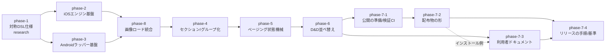

# KsCollectionView v1 立ち上げ

SwiftUI / Jetpack Compose で同じ書き味のリスト・グリッド部品を提供する2プラットフォームライブラリの初版開発。

## ゴール / 非ゴール

### ゴール

- リスト・グリッドの定型機能を SwiftUI / Compose の対称 DSL で提供する: ローディング表示・無限スクロール (ページング状態機械)・Pull to Refresh・仮想化・セクション/グループ化 (sticky ヘッダ)・D&D 並べ替え・ソート連携
- データ型によるテンプレート切り替え (異種セル)。再利用 (contentType / CellRegistration) と両立する宣言形式で提供する
- グループ化 + 画面向き (ポートレイト/ランドスケープ) で列数が変わる可変グリッド (自社実績機能)
- iOS は UICollectionView エンジン + `UIHostingConfiguration` セル、Android は Compose Lazy 系ラッパー (core/ADR-0001)
- 大量件数グリッドでの仮想化・再利用の成立 (必須要件)

### 非ゴール

- MAUI 対応 (cross/ADR-0001)
- KMP / CMP 対応 (Native UI 層から使う前提。ライブラリ自体は純ネイティブパッケージ)
- セクションごとに異なるレイアウトの混在 (横カルーセル埋め込み等の Compositional Layout フル活用) — プラットフォーム間の共通化が困難なため対象外
- 水平無限循環 (旧 HCollectionView の `IsInfinite` 相当) — ニッチのため対象外

## 前提 / 制約

- 最低対応 OS: **iOS 16+** (`UIHostingConfiguration` 依存) / **Android minSdk 29** (Android 10)
- 利用者: ネイティブアプリ開発者、または KMP 経由でネイティブ UI を書く開発者。主目的は自社 KMP アプリ量産時の UI 記述コスト削減、OSS 公開は副次 (cross/ADR-0001)
- リポジトリ構成: `../KsSettingsView/` と同型の monorepo (`ios/` `android/` ビルドルート)。skills/ 方式の利用者ドキュメントを踏襲
- CI (verify-ios / verify-android)・lockstep 単一バージョン・配布 (SPM / Maven、package-distribution 設計) は踏襲候補 — phase-7 で確定する
- 先行実装参照: iOS エンジンは KsSettingsViewUI (diffable + Compositional Layout) と旧 `../AiForms.CollectionView/` の `ContentCellContainer`
- 立ち上げ探索の経緯は [exploration.md](../../changes/archive/2026-09-05-revival-feasibility/exploration.md)
- Sample は各フェーズのパリティ検証装置とする (根拠: [cross/ADR-0004](../../decisions/cross/0004-sample-cross-platform-parity.md)、規約: [sample-parity](../../handbook/cross/sample-parity.md))
- phase-2 / phase-3 は各自の Sample scaffold (`SampleScreen` / `SampleTheme` / メニュー構造) と対向プラットフォームへの追随タスクを責務とし、両フェーズ完了時を最初のパリティ収束ゲートとする
- phase-4〜6 および phase-8 の機能フェーズは「デモ画面を両プラットフォームの Sample に sample-parity 準拠で追加」を完了条件に含める (phase-7 は配布・ドキュメント専業で対象外)

## 全体図

## フェーズ一覧

| ID | 状態 | 種別 | フェーズ詳細 | Change |
|---|---|---|---|---|
| phase-1-symmetric-dsl-spec | completed | research | [agenda](phases/phase-1-symmetric-dsl-spec/agenda.md) | — |
| phase-2-ios-engine-foundation | completed | change | [agenda](phases/phase-2-ios-engine-foundation/agenda.md) | [ios-engine-foundation](../../changes/archive/2026-09-04-ios-engine-foundation/proposal.md) |
| phase-3-android-wrapper-foundation | completed | change | [agenda](phases/phase-3-android-wrapper-foundation/agenda.md) | [android-wrapper-foundation](../../changes/archive/2026-09-05-android-wrapper-foundation/proposal.md) |
| phase-8-image-loading | completed | change | [agenda](phases/phase-8-image-loading/agenda.md) | [image-loading](../../changes/archive/2026-09-24-image-loading/proposal.md) / [prefetch-display-size](../../changes/archive/2026-09-24-prefetch-display-size/proposal.md) |
| phase-4-sections-grouping | completed | change | [agenda](phases/phase-4-sections-grouping/agenda.md) | [sections-grouping](../../changes/archive/2026-09-26-sections-grouping/proposal.md) |
| phase-5-paging-state-machine | completed | change | [agenda](phases/phase-5-paging-state-machine/agenda.md) | [paging-state-machine](../../changes/archive/2026-09-29-paging-state-machine/proposal.md) |
| phase-6-drag-reorder | completed | change | [agenda](phases/phase-6-drag-reorder/agenda.md) | [drag-reorder](../../changes/archive/2026-10-01-drag-reorder/proposal.md) |
| phase-7-1-public-repo-verify-ci | completed | change | [agenda](phases/phase-7-1-public-repo-verify-ci/agenda.md) | [public-repo-verify-ci](../../changes/archive/2026-10-08-public-repo-verify-ci/proposal.md) |
| phase-7-2-package-distribution | in-progress | change | [agenda](phases/phase-7-2-package-distribution/agenda.md) | — |
| phase-7-3-user-docs | in-progress | change | [agenda](phases/phase-7-3-user-docs/agenda.md) | — |
| phase-7-4-release-pipeline | in-progress | change | [agenda](phases/phase-7-4-release-pipeline/agenda.md) | — |
